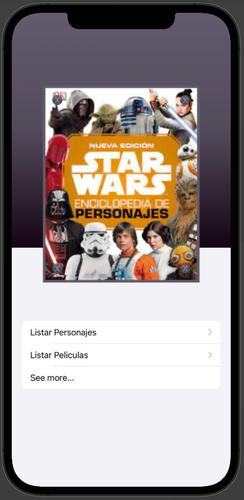

# StarsWars Encycloapedia App

This is my first app project which connects to the swapi api

## Table of contents

- [Overview](#overview)
  - [The challenge](#the-challenge)
  - [Screenshot](#screenshot) 
- [My process](#my-process)
  - [Built with](#built-with)
  - [What I learned](#what-i-learned)
  - [Continued development](#continued-development) 
- [Author](#author) 
 

## Overview

### The challenge

Users should be able to:

- Connect to two different endpoints of the api

### Screenshot
<p align="center">
   
</p>
 
## My process

### Built with

- Swift
- SwiftUI
- MVVM
 
### What I learned

The most important thing in this app was the api connection i'm very proud that i was able to connect to two diferents endpoints by myself.

To see how you can add code snippets, see below:

- getting the characters data

```swift
func getSwapis(){
        let url = URL(string: "https://swapi.dev/api/people/")
        URLSession.shared.dataTask(with: url!){ data, response, error in
            
            if let _ = error{
                print("Error")
            }
            
            if let data = data, let httpResponse = response as? HTTPURLResponse,
               httpResponse.statusCode == 200 {
                
                let swapiDataModel = try! JSONDecoder().decode(SwapiResponseDataModel.self, from: data)
                
                print("swapis \(swapiDataModel)")
                
                DispatchQueue.main.async{
                    self.swapis = swapiDataModel.swapis
                }
            }
            
        }.resume()
    }
```
- getting the movies data

```swift
func getMovies(){
        let url2 = URL(string: "https://swapi.dev/api/films/")
        URLSession.shared.dataTask(with: url2!){ data, response, error in
            
            if let _ = error{
                print("Error")
            }
            
            if let data = data, let httpResponse = response as? HTTPURLResponse,
               httpResponse.statusCode == 200 {
                
                let swapiMovieDataModel = try! JSONDecoder().decode(SwapiMovieResponseDataModel.self, from: data)
                
                print("swapis \(swapiMovieDataModel)")
                
                DispatchQueue.main.async{
                    self.swapisMovies = swapiMovieDataModel.swapisMovies
                }
            }
            
        }.resume()
    }
```
 
### Continued development

i want to refine my appdesign techniques, in this project i continued to work with the ui, also i want to add pagination to the app 
## Author

- Website - [karen cofre](http://bittenrainbow.me)   
